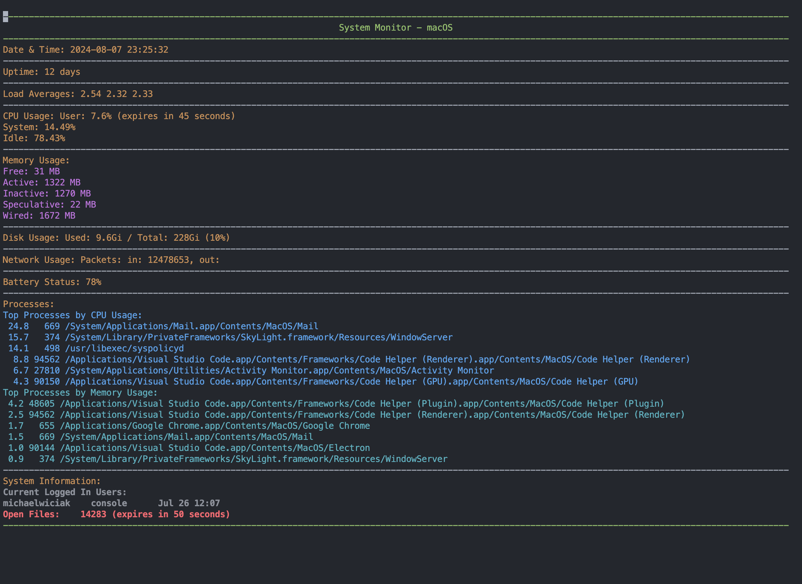

# PlayingWithBash

This repository contains a collection of Bash scripts designed to perform various tasks. Each script is tailored to solve a specific problem or provide utility in everyday tasks, from fetching weather information to monitoring system resources. Below is a detailed description of each script included in this repository.

## Weather Fetcher


### Overview

The Weather Fetcher script retrieves current weather data for a specified city using the OpenWeatherMap API. It is composed of a Bash script that handles the API interaction and a Python script for processing and displaying the data.

### How It Works

1. **Environment Setup:**  
   The script loads API credentials from a `.env` file. If the file or API key is missing, it prompts the user with an error message.

2. **Fetching Weather Data:**  
   The script accepts a city name as an argument and uses `curl` to fetch weather data in JSON format from the OpenWeatherMap API. 

3. **Data Processing:**  
   The JSON response is saved to `response.json`, which is then processed by a Python script (`weatherProcess.py`). The Python script:
   - Extracts relevant weather information.
   - Dynamically generates ASCII art representing the weather (e.g., rain, sunshine).
   - Creates a thermometer animation showing the temperature using the `generate_thermometer_art` function. The thermometer art adjusts its color based on the temperature (white for cold, red for hot, green for moderate).

### Usage

```bash
./weather_fetcher.sh <city_name>
```

## Website Availability Checker


### Overview

This script checks the availability of a given website by sending an HTTP request and analyzing the status code. It logs the results and can send email notifications if the website is down.

### How It Works

1. **Logging and Rotation:**  
   The script maintains a log file (`website_availability.log`) and rotates it when it exceeds a specified size (10MB), storing old logs in a `log_archive` directory.

2. **Checking Availability:**  
   The script sends an HTTP request to the provided URL and checks the returned status code:
   - If the website is available (status code 200), it logs the success.
   - If the website is unavailable, it logs the failure and sends an email notification to a predefined address using `msmtp`.

3. **Email Notification:**  
   The script is configured to send an email via `msmtp` if the website is down. The email includes the URL, status code, and timestamp.

### Usage

```bash
./website_availability_checker.sh <url>
```

For email setup, please refer to the README file in the `msmtp` configuration folder.

## Random Password Generator


### Overview

This script generates random passwords with customizable length and character sets. It supports including special characters, numbers, uppercase letters, and lowercase letters.

### How It Works

1. **Command-Line Options:**  
   The script accepts various options to customize the password:
   - `-l LENGTH`: Specify the length of the password.
   - `-s`: Include special characters.
   - `-n`: Include numbers.
   - `-u`: Include uppercase letters.
   - `-d`: Include lowercase letters.

2. **Password Generation:**  
   A random password is generated based on the selected character sets. The script ensures that the generated password meets all the inclusion criteria, adding missing character types if necessary.

3. **Clipboard and Logging:**  
   The generated password is automatically copied to the clipboard and logged to `password_log.log` with a timestamp and user information.

### Usage

```bash
./password_generator.sh [-l length] [-s] [-n] [-u] [-d]
```

## System Monitor Script



### Overview

This script monitors and displays various system metrics in real-time, including CPU usage, memory usage, disk usage, network activity, and more. It uses caching to improve performance and reduce resource consumption.

### How It Works

1. **Caching:**  
   The script caches certain metrics (e.g., CPU usage) to avoid repeatedly querying the system, with a configurable cache expiry time (default: 60 seconds).

2. **Metrics Displayed:**
   - **System Uptime:** How long the system has been running.
   - **Load Averages:** System load over the last 1, 5, and 15 minutes.
   - **CPU Usage:** Percentage of CPU used by user processes, system processes, and idle time.
   - **Memory Usage:** Amount of free, active, inactive, speculative, and wired memory.
   - **Disk Usage:** Space used and available on the main disk.
   - **Network Usage:** Number of packets sent and received.
   - **Battery Status:** Current battery percentage.
   - **Top Processes:** Processes using the most CPU and memory.
   - **Logged-In Users:** List of currently logged-in users.
   - **Open Files Count:** Total number of open files.

3. **Real-Time Update:**  
   The script continuously updates the display every second, providing a live view of system performance.

### Usage

```bash
./system_monitor.sh
```

